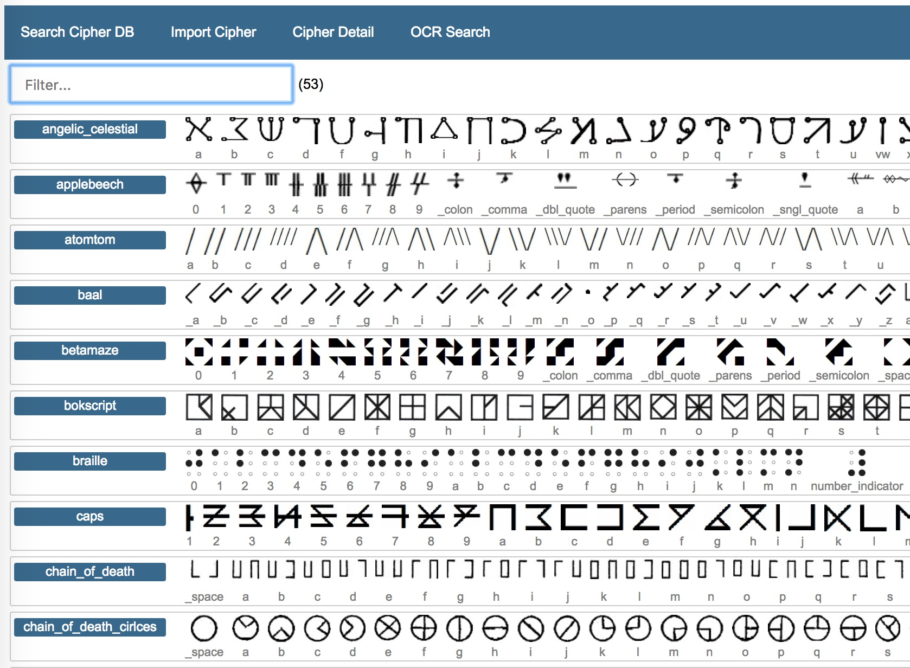
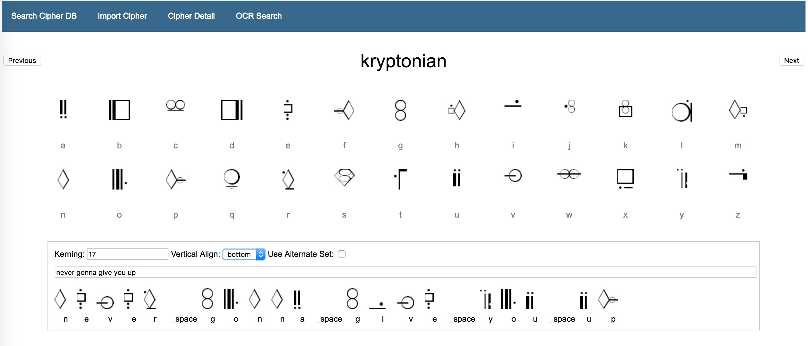
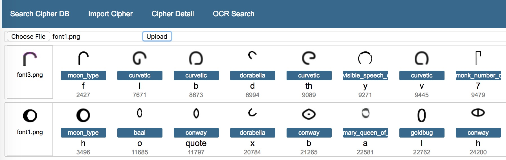
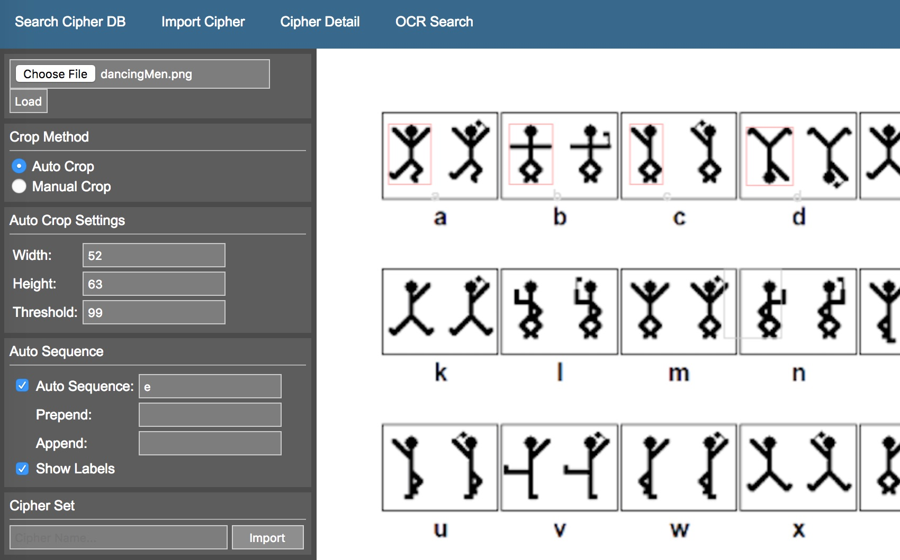

# cipher_db

## Getting Started
```
pip install opencv-python
pip install scikit-image

cd webapp
python ./webapp.py
```

## Search By Name or Browse All
 

## Create or Decipher Messages
 

## OCR for Unknown Ciphers
 

## Auto Crop Tools for Importing
 
